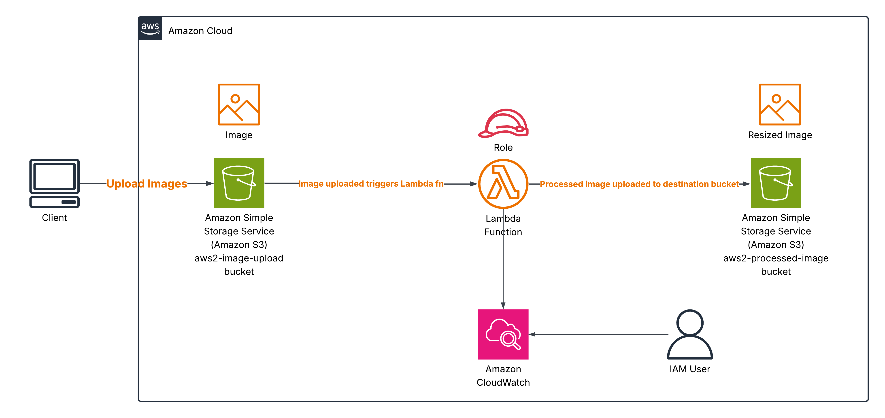

# Serverless Image Processing with AWS S3 and Lambda

A simple serverless image processing application built with AWS.  
Users can upload images to an **Amazon S3 bucket**, which automatically triggers an **AWS Lambda** function to process (resize, watermark, etc.) and store the processed images in a separate S3 bucket.

---

# 📖 Table of Contents
1. [Architecture Diagram](#-architecture-diagram)  
2. [Project Overview](#-project-overview)  
3. [Key AWS Services Used](#-key-aws-services-used)  
4. [Learning Outcomes](#-learning-outcomes)  
5. [Tips & Best Practices](#-tips--best-practices)  
6. [Demo Video](#-demo-video)

---

## 🏗 Architecture Diagram
  

---

# 📌 Project Overview
- **Architecture**: Serverless  
- **Workflow**:  
  1. User uploads an image to **S3 (original bucket)**.  
  2. **Lambda** is triggered automatically.  
  3. The function resizes  the image.  
  4. The processed image is stored in **S3 (processed bucket)**.  
 

---

## ☁️ Key AWS Services Used
- **Amazon S3** → Store both original and processed images.  
- **AWS Lambda** → Event-driven serverless compute for image processing.  
- **AWS Cloudwatch** → Track metadata such as filename, size, timestamp. 
- **IAM**  → Create roles and attach S3 bucket policies to the Lambda function.

---

## 🎯 Learning Outcomes
- Designing event-driven architectures using **Lambda + S3 triggers**.  
- Building cost-efficient, auto-scaling **serverless applications**.  
- Applying security best practices with **IAM roles** and **S3 bucket policies**.  

---

## 💡 Tips & Best Practices
- Use **separate buckets** for original and processed images.  
- Enable **versioning** on your S3 bucket for rollback safety.  
- Set up **least-privilege IAM roles** for Lambda.  
- Monitor and debug Lambda functions with **Amazon CloudWatch Logs**.  
- Optimize image processing code to minimize **execution time and cost**.  

---

# 🎥 Demo Video
Check out the full walkthrough of the project:  

➡️ [Watch Project Demo](https://drive.google.com/file/d/1rDBOSMyF3M7ZK5huPM05Z2d5NTJb7arw/view?usp=drive_link)  

---
